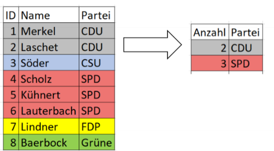
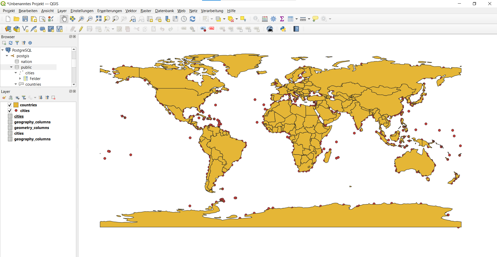

# Datenbanken <!-- omit in toc -->
Dieses File beinhaltete eine kleine Zusammenfassung der Vorlesung Datenbanken
# Inhaltsverzeichnis <!-- omit in toc -->
- [SQL-Befehle](#sql-befehle)
  - [SELECT](#select)
    - [Aufbau](#aufbau)
    - [Berechnungen](#berechnungen)
    - [Datum](#datum)
    - [Stringfunktionen](#stringfunktionen)
    - [Aggregatsfunktionen](#aggregatsfunktionen)
    - [Top](#top)
    - [Distinct](#distinct)
  - [CASE (SELECT ohne Tabelle)](#case-select-ohne-tabelle)
    - [Aufbau](#aufbau-1)
    - [Beispiele](#beispiele)
  - [ORDER BY (SELECT mit Tabelle)](#order-by-select-mit-tabelle)
    - [Aufbau](#aufbau-2)
    - [Beispiel](#beispiel)
    - [ASC](#asc)
    - [DESC](#desc)
  - [GROUP BY](#group-by)
    - [Aufbau](#aufbau-3)
    - [Beispiel](#beispiel-1)
  - [HAVING](#having)
    - [Aufbau](#aufbau-4)
    - [Beispiel](#beispiel-2)
  - [JOIN](#join)
    - [Aufbau](#aufbau-5)
    - [INNER JOIN](#inner-join)
    - [RIGTH/LEFT JOIN](#rigthleft-join)
    - [FULL OUTER JOIN](#full-outer-join)
  - [INSERT](#insert)
  - [UPDATE](#update)
  - [DELETE](#delete)
  - [CTEs](#ctes)
- [Tools](#tools)
  - [Data Grip](#data-grip)
  - [Q-Gis](#q-gis)
  - [DBeaver](#dbeaver)
- [Aufgaben](#aufgaben)
  - [MariaDB](#mariadb)
    - [Languages](#languages)
    - [World GDP](#world-gdp)
    - [World Population](#world-population)
  - [Postgis](#postgis)
  - [Hausaufgabe](#hausaufgabe)


# SQL-Befehle
Eine kleine Zusammenfassung der wichtigsten Befehle und Funktionen in SQL (Structured Query Language).

## SELECT
### Aufbau
1. **SELECT**
2. FROM
3. WHERE
4. ORDER BY
### Berechnungen
- Addition: ``SELECT a + b`` 
- Subtraktion: ``SELECT a - b``
- Multiplikation: ``SELECT a * b``
- Division: ``SELECT a / b``
- Modulo: ``SELECT a % b``
- Wurzel: ``SELECT SQRT(9), SQRT(25)``
- Quadrat: ``SELECT SQUARE(3), SQUARE(5)``
- Absolutbetrag: ``SELECT ABS(-20), ABS(20)``
- Vorzeichen: ``SELECT SIGN(-42), SIGN(42)``
- Runden: ``SELECT ROUND(0.25,1)`` 
### Datum
- Aktuelle Zeit: ``SELECT GETDATE()``
- Aktuelle Uhrzeit: ``SELECT CAST(GETDATE() AS TIME)``
- Aktuelles Datum: ``SELECT CAST(GETDATE() AS DATE)``
- Differenz: ``SELECT DATEDIFF(DAY, '2021-10-07', '2021-10-14')``
- Addition: ``SELECT DATEADD(WEEK, 3, '2021-10-01')``
### Stringfunktionen
- Verknüpfen: ``SELECT CONCAT('Hier', 'steht', 'Text')``
- Ausschneiden: 
  - ``SELECT LEFT('Hier steht Text', 7)`` 
  - ``SELECT RIGHT('Hier steht Text', 7)``
  - ``SELECT SUBSTRlNG('Hier steht Text', 1, 4)``
- Finden: ``SELECT PATINDEX('%steht%', 'Hier steht Text')``
- Ersetzen: ``SELECT REPLACE('Hier steht Text', 'steht', 'stand')`` 
- Trimmen: ``SELECT TRIM(' Leerzeichen vorne und hinten ')``
- Länge ermitteln: ``SELECT LEN('Beispieltext')``
### Aggregatsfunktionen
- Anzahl: ``SELECT COUNT()``
- Minimalwert: ``SELECT MIN()``
- Maximalwert: ``SELECT MAX()``
- Durschnitt: ``SELECT AVG()``
### Top
``` sql
SELECT TOP 4 Name, Partei
FROM Politiker
```
--> Die ersten 4 Namen der Poltiker mit der entsprechenden Partei werden ausgegeben
### Distinct
``` sql
SELECT DISTINCT Partei
FROM Politiker
```
--> Alle Parteien werden Ausgegeben allerding nur 1 mal pro Partei (keine Wiederholung)

## CASE (SELECT ohne Tabelle)
### Aufbau
``` sql
CASE 
WHEN <Bedingung> THEN <Wahr_Ausgabe> ELSE <Falsch_Ausgabe>
END
```
### Beispiele 
``` sql
SELECT CASE WHEN 1<2 THEN 'Größer' ELSE 'Kleiner' END
```
``` sql
SELECT CASE WHEN 3<2 THEN 'Größer' ELSE 'Kleiner' END 
```

## ORDER BY (SELECT mit Tabelle)
### Aufbau
1. SELECT
2. FROM
3. WHERE
4. **ORDER BY**
### Beispiel
``` sql
SELECT Name, Partei
FROM Politiker
ORDER BY Name
```
### ASC
Die Ordnung erfolgt aufsteigend -> zuerst kleine Zahlen bzw. Buchstaben am Anfang des Alphabets
``` sql
SELECT Name, Partei
FROM Politiker
ORDER BY Name ASC
```
### DESC
Die Ordnung erfolgt absteigend -> zuerst große Zahlen bzw. Buchstaben am Ende des Alphabets
``` sql
SELECT Name, Partei
FROM Politiker
ORDER BY Name DESC
```

## GROUP BY
### Aufbau
1. SELECT
2. FROM
3. WHERE
4. **GROUP BY**
5. ORDER BY
### Beispiel
```sql
SELECT COUNT(Politiker.ID), Partei.Name
FROM Partei
JOIN Politiker ON Politiker.ID = Politiker.Partei
GROUP BY Partei.Name
```

## HAVING
### Aufbau
1. SELECT
2. FROM
3. WHERE
4. GROUP BY
5. **HAVING**
6. ORDER BY
### Beispiel
```sql
SELECT COUNT(Politiker.ID), Partei.Name
FROM Partei
JOIN Politiker ON Politiker.ID = Politiker.Partei
GROUP BY Partei.Name
HAVING COUNT(Politiker.ID) > 1
```


## JOIN
Dient zur Verknüpfung meherer Tabellen miteinander anahnd einer Bedingung (oft Gleichheit von Primär- und Fremdschlüsseln)
### Aufbau 
1. SELECT
2. FROM **inkl. JOINs**
3. WHERE
4. ORDER BY
### INNER JOIN
> Datensätze beider Tabellen werden anhand der Bedingung 
verbunden, d.h. die Datensätze beider Tabellen müssen diese erfüllen 
``` sql
SELECT * 
FROM Politiker 
JOIN Partei ON Politiker.Partei = Partei.ID
```

### RIGTH/LEFT JOIN
>  Datensätze beider Tabellen werden anhand der 
Bedingung verbunden und zusätzlich alle Datensätze der rechten/linken 
Tabelle, auch wenn diese nicht die Bedingung erfüllen

**LEFT JOIN:**
``` sql
SELECT * 
FROM Politiker 
LEFT JOIN Partei ON Politiker.Partei = Partei.ID
```

**RIGHT JOIN:**
``` sql
SELECT * 
FROM Politiker 
RIGHT JOIN Partei ON Politiker.Partei = Partei.ID
```

### FULL OUTER JOIN
> Datensätze beider Tabellen werden anhand der 
Bedingung verbunden und zusätzlich alle Datensätze der rechten und 
linken Tabelle, auch wenn diese nicht die Bedingung erfüllen
``` sql
SELECT *
FROM Politiker
FULL JOIN Partei ON Politiker.Partei = Partei.ID
```


## INSERT
## UPDATE
## DELETE
## CTEs

# Tools
## Data Grip
## Q-Gis
Ein Tool zum visualisieren von geospazialen Daten.

## DBeaver
# Aufgaben
## MariaDB
### Languages
### World GDP
### World Population
## Postgis
## Hausaufgabe