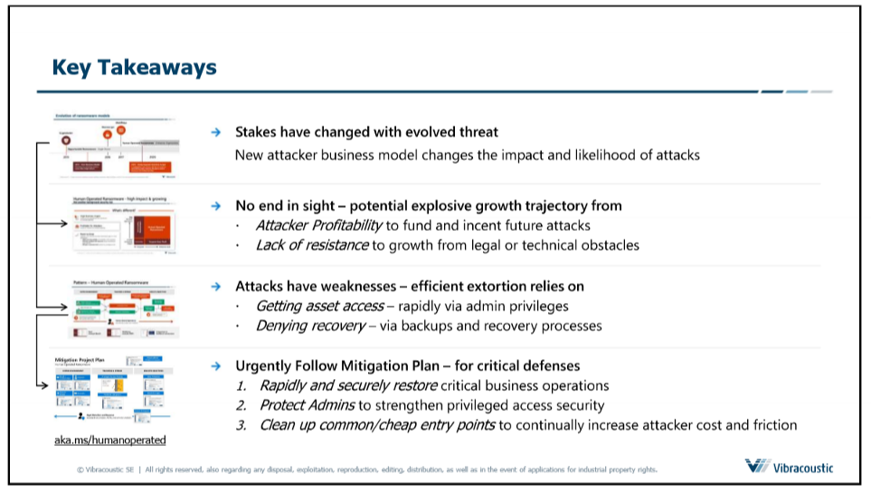

# IT-Recht <!-- omit in toc -->
Dieses File beinhaltete eine kleine Zusammenfassung der Vorlesung IT-Recht. :man_student:
# Inhaltsverzeichnis <!-- omit in toc -->
- [Derzeitige Sicherheitssituation](#derzeitige-sicherheitssituation)
  - [Human Operated Ransomware](#human-operated-ransomware)
  - [Schwachstellen im Information Security Managment System (ISMS) und der Cyber Security](#schwachstellen-im-information-security-managment-system-isms-und-der-cyber-security)
- [Standardisierung](#standardisierung)
  - [Prozess zum implementieren eines Information Sicherheit Management Systems (ISMS):](#prozess-zum-implementieren-eines-information-sicherheit-management-systems-isms)
- [KRITS](#krits)
- [ISO 27001](#iso-27001)
  - [Anmerkungen](#anmerkungen)
  - [Inhalt:](#inhalt)
    - [Deming Circle aka PDCA Cycle:](#deming-circle-aka-pdca-cycle)
  - [Zertifizierungsprozess](#zertifizierungsprozess)
- [Ausländisches Datenschutzrecht](#ausländisches-datenschutzrecht)
  - [China](#china)
- [Rechtliche Situation in Deutschland](#rechtliche-situation-in-deutschland)
  - [Geschäftsgeheimnisgesetz (GeschGehG)](#geschäftsgeheimnisgesetz-geschgehg)
    - [Überblick](#überblick)
  - [Telekommunikationsgesetz (TKG)](#telekommunikationsgesetz-tkg)
  - [Telemediengesetz (TMG)](#telemediengesetz-tmg)
  - [Betriebsverfassungsgesetz](#betriebsverfassungsgesetz)
  - [BSI Gesetz (BSIG)](#bsi-gesetz-bsig)
- [Internationale Rechtssituation](#internationale-rechtssituation)
  - [China](#china-1)
  - [USA](#usa)

# Derzeitige Sicherheitssituation
Die aktuelle internationale Sicherheitssituation wird so eingeschätzt, dass es ein **hohes Risiko** für **Cyberattacken** gibt. Die aktuell größte Bedrohung stellt **Ransomware** dar. Dabei weitet sich der Scope auf Enterprise Level aus, das heißt es wird versucht alle Daten und Systeme eines gesamten Unternehmens zu verschlüsseln. Der aktuelle State of the Art im Bezug auf Ransomware ist demnach **Human Operated Ransomware**.
## Human Operated Ransomware
Ein Angriff mithilfe von Human Operated Ransomware läuft im wesentlichen in 3 Schritten ab:
1. **Eindringen in die Umgebung**
2. **Systeme des Unternehmens infizieren**
3. **Systeme koordiniert verschlüsseln**
   
Alle diese Schritte werden von einem **menschlichen Operator** überwacht und geleitet. Dabei werden **Scripts** und **Malware** als Hilfsmittel verwendet. 
- Human Operated Ransomware hat aufgrund des ausgeweiteten Scopes einen **hohen Business Impact**
- Attacken sind idR. **sehr profitabel** für den Angreifer

**Kernpunkte:**

## Schwachstellen im Information Security Managment System (ISMS) und der Cyber Security

- unklare Voraussetzungen z.B. im Bezug auf die Stakeholder
- fehlendes Infosec Processing Model
- Fehlende Lifecycle für Produkte und Services
- einziger Schwerpunkt auf die IT
- fehlende Standardisierung
- fehlender Notfallplan
- viele Schwachstellen in Software
- fehlende Absicherung gegen Malware
- fehlende Internationale Identifikation und Autorisierung (z.B. Geschäftsreisen)

**weitere potenzielle Einfallstüren**:
- unsichere Webseiten
- E-Mail (immer weniger)
- zu viel Datenfreigabe (z.B. soziale Medien)
- fehlende Internet Kompetenz im Allgemeinen
- Mobile Endgeräte
- manipulierte IT (z.B. O.MG Cable etc.)
- unsichere IOT
- Fake News
- Geheimdienste

# Standardisierung
Mögliche Standards:
- **ISO 27001**
- **TISAX** (Trusted Information Security Assessment Exchange)
    - Zertifizierung für Automobilhersteller
- **BSI Standard 200**
- KRITIS
- IT-Sicherheitsgestz

## Prozess zum implementieren eines Information Sicherheit Management Systems (ISMS):

1. **Prozess startet im Top Management:**
    - strategische Entscheidungen treffen
    - Scope festlegen
    - policies bestimmen
    - Rollen und Verantwortungen vergeben
2. **Voraussetzungen festlegen z.B. für ISO 27001**
3. **Stakeholder bestimmen**
4. **ISMS Scope bestimmen -> Scope bestimmt das Management**
5. **GAP Analyse ausführen**
    - stellt benötigte Zeit fest
    - derzeitiger Status
    - nötige Verbesserungen
    - benötigtes Kapital
6. **Benötigte Zeit und Kapital abschätzen:**
    - Standard Projekt Management Aufgabe
7. **Management Approval einholen (schriftlich)**
8. **Project starten**

# KRITS
KRITIS steht für **kritische Infrastruktur**. Unter diesen Begriff fällt alles was von Grundlegender Bedeutung für die **Gesellschaft** oder **Wirtschaft** ist, sodass ein Ausfall dieser zu **Lieferengpässen**, **öffentlichem Sicherheitsverlust** oder anderen **dramatische Konsequenzen** führen könnte.

Konkret zählen Organisationen aus folgenden Sektoren zur KRITIS:
- Energie
- Gesundheit
- IT
- Transport
- Medien und Kultur
- Wasser
- Finanzen
- Lebensmitteln
- Staat

*Note: **KRITIS** sind aufgrund ihrer wichtigkeit zu folgenden Dingen **verpflichtet**:*

- Kontaktierbar zu sein
- jeden IT Vorfall zu melden
- State of the Art zu implementieren
- alle 2 Jahre Nachweise zu liefern (z.B. ISO 27001)

# ISO 27001
## Anmerkungen
- **die Norm ist immer 27001**
- 27002 -> zeigt nur das das Unternehmen die Richtlinien kennt und sich daran weitesgehend hält
- 27006 -> Prüfung um Zertifikate ausstellen zu dürfen
- ISO 27001 definiert ein ISMS welches Information Security unter **Management Kontrolle** stellt
- **Zertifizierung kann verlangt werden z.B. KRITIS**

## Inhalt:

### Deming Circle aka PDCA Cycle:

  - in der Mitte steht das IT Governance Framework
  - 4 verschiedene Phasen:
      - Plan:
          - Plan erstellen um gewünschte Ergebnisse zu erzielen
      - Do:
          - ausführen des Plans
      - Check:
          - Daten aus der Do Phase werden evaluiert
          - u.a. auch Pen testing mit entsprechenden Reports
      - Act:
          - auch adjust genannt
          - hier werden Prozesse verbessert mit den Ergebnissen aus Do und Check -> bessere Standards, Instructions oder Ziele
  - um langfristig erfolgreich zu sein, sollten nach einem Durchlauf des Deming Cycles neue Standards gesetzt werden
  

## Zertifizierungsprozess

1. Preperation & Documentation
2. Stage 1 Audit:
    - Bereitschaftsbewertung
3. ISMS Implementation:
    - Dauer: zwischen 6 - 9 Wochen
4. Stage 2 Audit:
    - vor Ort besuch mit Kontrolle der Implementierung mit Fokus auf Wirksamkeit
    - Interviews mit Management
    - KPIs etc.
5. ISMS Maintenance and Improvement
6. On-going Audits:
    - zusätzliche Audits
    - alle 6 oder 12 Monate

# Ausländisches Datenschutzrecht
## China 

# Rechtliche Situation in Deutschland

## Geschäftsgeheimnisgesetz (GeschGehG)
§ 1 Anwendungsbereich
§ 2 Begriffsbestimmung 
§ 3 Erlaubte Handlung 
§ 4 Handlungsverbote 
§ 5 Ausnahmen 
1. Presse- und Meinungsfreiheit
2. Straftatbestand 
### Überblick
- Es müssen angemessene Schutzmaßnamen für IP des Unternehmens getroffen werden
- Verantwortung liegt alleine beim Unternehmen
- Reverse Engineering und Whistleblowing wird erlaubt

## Telekommunikationsgesetz (TKG)
**§ 1 Zweck des Gesetzes**
> Zweck dieses Gesetzes ist es, durch technologieneutrale Regulierung den Wettbewerb im Bereich der Telekornmunikabon und Telekommunikationsinfrastrukturen zu fördern und flächendeckend angemessene und ausreichende zu gewährleisten.
- **Wettbewerb fördern**
- **Gewährleistung von Dienstleistungen**

§ 2 Regulierung, Ziele, Grundsätze
- Vermeidung von Monopolen
- keine Wettbewerbsverzerrung
- Entwicklung des EU-Binnenmarkts
- gleiche Grundversorgung in Stadt und auf dem Land

**§ 88 Fernmeldegeheimnis**
- **Art 10 GG** -> Brief, Post- und Fernmeldegehimnis sind unverletzlich  
  *Aber: kein Schutz vor Geheimdienste* -> Erlaubnis zur Überwachung
- schützt **Kommunikationvorgang an sich** (sobald die Daten abgelegt sind gilt § 88 nicht mehr)

§ 89 Abhörverbot, Geheimhaltungspflicht von Betreibern von Empfangsanlagen
- man darf nicht Abhören :joy:

§ 90 Missbrauch von Sende- oder sonstigen Telekommunikationsanlagen
- man darf keine Anlagen betreiben, die zum abhören gedacht sind, indem sie **andere Gegenstände vortäuschen** (Fake-Router, O.MG Cable, etc.)
- öffentliche Kameras im öffentlichen Raum sind erlaubt
- Smart Home ist nicht verboten

§ 148 Strafvorschriften
- Freiheitstrafe bis 2 Jahre

## Telemediengesetz (TMG)
**§ 1 Anwendungsbereich**
- gilt für gespeicherte Daten
- gilt nicht für Steuerbehörde

§ 2 Begriffbestimmungen
- Arbeitgeber fallen idR nicht unter TMG

§ 7 Allgemeine Grundsätze
- Platform kann nicht für die Inhalte verantwortlich gemacht werden

§ 8 Durchleitung von Informationen
- Arbeitgeber sind idR keine Diensteanbieter -> Authentifizierung

§ 9 Zwischenspeicherung zur beschleunigten der Übermittlung von Information

§ 10 Speicherung von Informationen

## Betriebsverfassungsgesetz
§ 87 Mitbestimmungsrecht
- bei Verhaltens- oder Leistungsüberwachung darf Betriebsrat mitbestimmen
  
## BSI Gesetz (BSIG)
§ 1 Bundesamt für Sicherheit in der Informationstechnik
- zuständig auf nationaler Ebene

§ 3 Aufgaben des Bundesamtes
- im öffentlchen Interesse
- Funktionssicherheit der Bundesbehörden
- unterstützt Behörden (Strafverfolgung, Sicherheitsdienste)

§ 3a Verarbeitung personenbezogener Daten
- Daten verarbeitung zulässig wenn öffentliches Interesse im Vordergrund steht
- Bundesamt darf Zweck für Datenerhebung ggf ändern

§ 4 Zentrale Meldestelle für die Sicherheit in der Informationstechnik des Bundes

§ 5 Abwehr von Schadprogrammen und Gefahren für die Kommunikationstechnik des Bundes

§ 8a Sicherheit in der Informationstechnik Kritischer Infrastruktur
- KRITIS -> Verfügbarkeit oberstes Schutzziel

§ 823 Schadensersatzpflicht

# Internationale Rechtssituation

## China 
- ISMS wird von allen Unternehmen gefordert
- wenn man als Unternehmen CyberSecurity Anwendungen verwendet muss man von China lizensierte Software installieren 

## USA
NIST 800-171 Protection Controlled Unclassified Information  

National Defense Authorization Act
- sobald eine Behörde ein Unternehmen beauftragt, muss die Behörde sicher gehen, dass diese keine **Huawei Technolgie** oder **ZTE Geräte** verwenden (Handelskrieg)
- selbes gilt für **Hikvision**, **Hytera** und **Dahua**
- keine Beauftragung von militärrelevanten Unternehmen in China