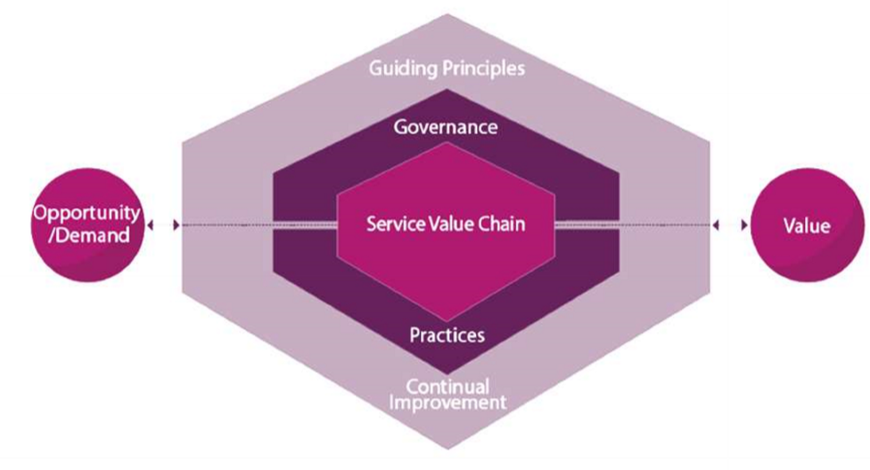
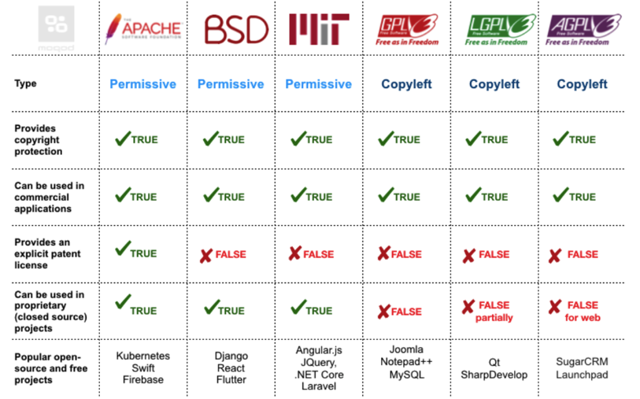

# IT-Recht <!-- omit in toc -->
Dieses File beinhaltete eine kleine Zusammenfassung der Vorlesung IT-Recht. :man_student:
# Inhaltsverzeichnis <!-- omit in toc -->
- [Derzeitige Sicherheitssituation](#derzeitige-sicherheitssituation)
  - [Human Operated Ransomware](#human-operated-ransomware)
  - [Schwachstellen im Information Security Managment System (ISMS) und der Cyber Security](#schwachstellen-im-information-security-managment-system-isms-und-der-cyber-security)
- [Standardisierung](#standardisierung)
  - [Prozess zum implementieren eines Information Sicherheit Management Systems (ISMS):](#prozess-zum-implementieren-eines-information-sicherheit-management-systems-isms)
- [Schutzziele](#schutzziele)
- [ITIL](#itil)
  - [ITIL v3](#itil-v3)
  - [ITIL v4](#itil-v4)
- [KRITIS](#kritis)
- [ISO 27001](#iso-27001)
  - [Anmerkungen](#anmerkungen)
  - [Inhalt:](#inhalt)
    - [Deming Circle aka PDCA Cycle:](#deming-circle-aka-pdca-cycle)
  - [Zertifizierungsprozess](#zertifizierungsprozess)
- [BSI 200](#bsi-200)
  - [Inhalt](#inhalt-1)
  - [Zusammenfassung](#zusammenfassung)
- [InfoSec Wheel](#infosec-wheel)
  - [Core Teams](#core-teams)
  - [Mixed Teams](#mixed-teams)
  - [CISO](#ciso)
- [DSGVO](#dsgvo)
  - [Grundsätze des Datenschutzes in Deutschland](#grundsätze-des-datenschutzes-in-deutschland)
  - [Geltungsbereich](#geltungsbereich)
  - [Art 4: Definitionen](#art-4-definitionen)
  - [Art 5: Prinzipien bezogen auf die Verarbeitung von personenbezogenen Daten](#art-5-prinzipien-bezogen-auf-die-verarbeitung-von-personenbezogenen-daten)
  - [Art 6: Rechtmäßige Verarbeitung](#art-6-rechtmäßige-verarbeitung)
  - [Art 7: Vorraussetzungen für die Einwilligung](#art-7-vorraussetzungen-für-die-einwilligung)
  - [Art 8: Zustimmung von Minderjährigen](#art-8-zustimmung-von-minderjährigen)
  - [Art 9: Verarbeitung von speziellen personenbezogenen Daten](#art-9-verarbeitung-von-speziellen-personenbezogenen-daten)
  - [Art 10: Verarbeitung von personenbezogenen Daten mit Bezug zu Straftaten und strafrechtlicher Verfolgung](#art-10-verarbeitung-von-personenbezogenen-daten-mit-bezug-zu-straftaten-und-strafrechtlicher-verfolgung)
  - [Art 12:](#art-12)
  - [Art 13:](#art-13)
  - [Art 14:](#art-14)
  - [Art 17: Recht auf Löschung](#art-17-recht-auf-löschung)
  - [Betroffenen-Rechte nach DSGVO](#betroffenen-rechte-nach-dsgvo)
- [Ausländisches Datenschutzrecht](#ausländisches-datenschutzrecht)
  - [Türkei](#türkei)
  - [Brasilien](#brasilien)
  - [Russland](#russland)
  - [Thailand](#thailand)
  - [USA](#usa)
  - [China](#china)
- [Rechtliche Situation in Deutschland](#rechtliche-situation-in-deutschland)
  - [Geschäftsgeheimnisgesetz (GeschGehG)](#geschäftsgeheimnisgesetz-geschgehg)
    - [Überblick](#überblick)
  - [Telekommunikationsgesetz (TKG)](#telekommunikationsgesetz-tkg)
  - [Telemediengesetz (TMG)](#telemediengesetz-tmg)
  - [Betriebsverfassungsgesetz](#betriebsverfassungsgesetz)
  - [BSI Gesetz (BSIG)](#bsi-gesetz-bsig)
- [Internationale Rechtssituation](#internationale-rechtssituation)
  - [China](#china-1)
  - [USA](#usa-1)
  - [Open Source](#open-source)
    - [Copyright/Copyleft](#copyrightcopyleft)
- [Workshop Legal Situation](#workshop-legal-situation)
  - [Zugriff auf Internet Access Protocol eines Mitarbeiters](#zugriff-auf-internet-access-protocol-eines-mitarbeiters)
  - [Zugriff auf persönliche Mailbox](#zugriff-auf-persönliche-mailbox)
  - [Zugriff auf funktionale Mailbox](#zugriff-auf-funktionale-mailbox)
  - [Computer Transaction Logs von Mitarbeitern](#computer-transaction-logs-von-mitarbeitern)
  - [Bulletproof Hoster](#bulletproof-hoster)
  - [Sanktionskatalog für Disziplinarprozess für ISO27001](#sanktionskatalog-für-disziplinarprozess-für-iso27001)
- [Zero Trust](#zero-trust)
  - [Herausforderungen in der modernen Welt](#herausforderungen-in-der-modernen-welt)
  - [Security Modernization Imperatives](#security-modernization-imperatives)
  - [Zero Trust Komponenten](#zero-trust-komponenten)
  - [Zero Trust Core Principals](#zero-trust-core-principals)
  - [Netzwerk vs Identity Kontrolle](#netzwerk-vs-identity-kontrolle)
  - [Managing organizational risk](#managing-organizational-risk)
  - [Attack Chains](#attack-chains)

# Derzeitige Sicherheitssituation
Die aktuelle internationale Sicherheitssituation wird so eingeschätzt, dass es ein **hohes Risiko** für **Cyberattacken** gibt. Die aktuell größte Bedrohung stellt **Ransomware** dar. Dabei weitet sich der Scope auf Enterprise Level aus, das heißt es wird versucht alle Daten und Systeme eines gesamten Unternehmens zu verschlüsseln. Der aktuelle State of the Art im Bezug auf Ransomware ist demnach **Human Operated Ransomware**.
## Human Operated Ransomware
Ein Angriff mithilfe von Human Operated Ransomware läuft im wesentlichen in 3 Schritten ab:
1. **Eindringen in die Umgebung**
2. **Systeme des Unternehmens infizieren**
3. **Systeme koordiniert verschlüsseln**
   
Alle diese Schritte werden von einem **menschlichen Operator** überwacht und geleitet. Dabei werden **Scripts** und **Malware** als Hilfsmittel verwendet. 
- Human Operated Ransomware hat aufgrund des ausgeweiteten Scopes einen **hohen Business Impact**
- Attacken sind idR. **sehr profitabel** für den Angreifer

**Kernpunkte:**

## Schwachstellen im Information Security Managment System (ISMS) und der Cyber Security

- unklare Voraussetzungen z.B. im Bezug auf die Stakeholder
- fehlendes Infosec Processing Model
- Fehlende Lifecycle für Produkte und Services
- einziger Schwerpunkt auf die IT
- fehlende Standardisierung
- fehlender Notfallplan
- viele Schwachstellen in Software
- fehlende Absicherung gegen Malware
- fehlende Internationale Identifikation und Autorisierung (z.B. Geschäftsreisen)

**weitere potenzielle Einfallstüren**:
- unsichere Webseiten
- E-Mail (immer weniger)
- zu viel Datenfreigabe (z.B. soziale Medien)
- fehlende Internet Kompetenz im Allgemeinen
- Mobile Endgeräte
- manipulierte IT (z.B. O.MG Cable etc.)
- unsichere IOT
- Fake News
- Geheimdienste

# Standardisierung
Mögliche Standards:
- **ISO 27001**
- **TISAX** (Trusted Information Security Assessment Exchange)
    - Zertifizierung für Automobilhersteller
- **BSI Standard 200**
- KRITIS
- IT-Sicherheitsgestz

## Prozess zum implementieren eines Information Sicherheit Management Systems (ISMS):

1. **Prozess startet im Top Management:**
    - strategische Entscheidungen treffen
    - Scope festlegen
    - policies bestimmen
    - Rollen und Verantwortungen vergeben
2. **Voraussetzungen festlegen z.B. für ISO 27001**
3. **Stakeholder bestimmen**
4. **ISMS Scope bestimmen -> Scope bestimmt das Management**
5. **GAP Analyse ausführen**
    - stellt benötigte Zeit fest
    - derzeitiger Status
    - nötige Verbesserungen
    - benötigtes Kapital
6. **Benötigte Zeit und Kapital abschätzen:**
    - Standard Projekt Management Aufgabe
7. **Management Approval einholen (schriftlich)**
8. **Project starten**

# Schutzziele 
# ITIL
## ITIL v3
**KLassen**:
- Service Strategy
- Service Design
- Service Transition
- Service Operation
- Continual Service Improvement
  
-> CISO ist zuständig für den Bereich des continual service improvements 
-> Es fehlt Bezug zum Unternehmen/Geschäftsführung
## ITIL v4 
ITIL v4 ist die neueste ITIL Version (seit 2018) -> Viele Unternehmen verwenden dementsprechen noch ITIL v3. Im Gegensatz zu v3 kommen die **Guidingprincipals** in v4 nicht aus der IT sondern von der **Geschäfstführung**. ITIL v4 besteht aus 2 Kernkomponeneten:
1. Vier-dimensions-Modell 
2. Service value system (SVS) 
# KRITIS
KRITIS steht für **kritische Infrastruktur**. Unter diesen Begriff fällt alles was von Grundlegender Bedeutung für die **Gesellschaft** oder **Wirtschaft** ist, sodass ein Ausfall dieser zu **Lieferengpässen**, **öffentlichem Sicherheitsverlust** oder anderen **dramatische Konsequenzen** führen könnte.

Konkret zählen Organisationen aus folgenden Sektoren zur KRITIS:
- Energie
- Gesundheit
- IT
- Transport
- Medien und Kultur
- Wasser
- Finanzen
- Lebensmitteln
- Staat

*Note: **KRITIS** sind aufgrund ihrer wichtigkeit zu folgenden Dingen **verpflichtet**:*

- Kontaktierbar zu sein
- jeden IT Vorfall zu melden
- State of the Art zu implementieren
- alle 2 Jahre Nachweise zu liefern (z.B. ISO 27001)

# ISO 27001
## Anmerkungen
- **die Norm ist immer 27001**
- 27002 -> zeigt nur das das Unternehmen die Richtlinien kennt und sich daran weitesgehend hält
- 27006 -> Prüfung um Zertifikate ausstellen zu dürfen
- ISO 27001 definiert ein ISMS welches Information Security unter **Management Kontrolle** stellt
- **Zertifizierung kann verlangt werden z.B. KRITIS**

## Inhalt:

### Deming Circle aka PDCA Cycle:

  - in der Mitte steht das IT Governance Framework
  - 4 verschiedene Phasen:
      - Plan:
          - Plan erstellen um gewünschte Ergebnisse zu erzielen
      - Do:
          - ausführen des Plans
      - Check:
          - Daten aus der Do Phase werden evaluiert
          - u.a. auch Pen testing mit entsprechenden Reports
      - Act:
          - auch adjust genannt
          - hier werden Prozesse verbessert mit den Ergebnissen aus Do und Check -> bessere Standards, Instructions oder Ziele
  - um langfristig erfolgreich zu sein, sollten nach einem Durchlauf des Deming Cycles neue Standards gesetzt werden
  

## Zertifizierungsprozess

1. Preperation & Documentation
2. Stage 1 Audit:
    - Bereitschaftsbewertung
3. ISMS Implementation:
    - Dauer: zwischen 6 - 9 Wochen
4. Stage 2 Audit:
    - vor Ort besuch mit Kontrolle der Implementierung mit Fokus auf Wirksamkeit
    - Interviews mit Management
    - KPIs etc.
5. ISMS Maintenance and Improvement
6. On-going Audits:
    - zusätzliche Audits
    - alle 6 oder 12 Monate

# BSI 200
## Inhalt
Unterteilung in 5 Bestandteile:
1. BSI-Standard 200-1
   - ISMS:
     - Sicherheitsstrategie ist zentraler Bestandteil des ISMS (Strategei immer Teil der Firmenpolitik)
     - Lebenszyklus nach Deming-Zyklus
2. BSI-Standard 200-2
   - IT-Grundschutz-Methodik:
     - Unterteilung in Kern, Basis und Standard Absicherung: 
     - **Schutzbedarfsermittlung** wird mit dem Managment durchgeführt -> **Managment entscheidet**
     - bildet **Schnittstelle zur Management Ebene**
3. BSI-Standard 200-3
   - Risiko Analyse
4. BSI-Standard 200-4
   - Notfallmanagement
5. BSI IT-Grundschutz-Kompendium

## Zusammenfassung

# InfoSec Wheel

## Core Teams
**Red Team**
- Offensive Security Team
- Pen-testing
- ethical hacking

**Blue Team**
- Defensive Security Team
- Incident Response (IR)
- Threat Hunting

**Yellow Team**
- Software Engineers 
- Developer

## Mixed Teams
**Green Team**
- zwischen Yellow und Blue Team

**Orange Team**
- zwischen Yellow und Red Team

**Purple Team**
- zwischen Red und Blue Team
- Verteidigungstaktiken mit Ergebnissen der Offensive integrieren

## CISO
Die Position des CISO hat im InfoSec Wheel eine sonderstellung ist im Bereich des White Teams in der mItte des Wheels anzusiedeln.

# DSGVO
- Datenschutzgrundverordnung (DSGVO) 2016 beschlossen und seit 2018 in Kraft
- deutsche Implementierung im BDSG
- Kirchen sind von der DSGVO ausgenommen 
## Grundsätze des Datenschutzes in Deutschland
1. Datenschutz schützt **keine Daten** sondern die hinter den Daten stehenden **Personen**
2. Zum Datenschutz gehört auch die IT-Sicherheit -> technisch organisatorischer Schutz von Daten. Dieser Schutz wird durch TOMs umgesetzt
3. Grundrecht auf informationelle Selbstbestimmung
4. 'Verbot mit Erlaubnisvorbehalt' -> Datenverarbeitung grundsätzlich verboten
## Geltungsbereich
- Die DSGVO gilt grundsätzlich in allen EU Staaten
- in manchen Ländern außerhalb der EU gelten ähnliche Gesetze (z.B. Schweiz, Argentien, Japan, etc.)
## Art 4: Definitionen
**Personenebezogene Daten** 
> Personenbezogene Daten meint jede Art von daten mit deinen eine Person identfiziert wird oder werden kann. Eine Identifizierbare Person ist dabei eine Person die Anhand eines Identifieres wie beispielsweise eines Namens, Telefonummer, etc einer Identität/Gruppierung zugeordnet werden kann.

**Processing/Datenverarbeitung**
> Als Processing wird jeglich Verarbeitung von personenbezogenen Daten oder einem Datensatz dieser bezeichnet.

**Pseudonymisierung**
> Pseudonymisierung ist eine Art der Datenverabeitung von personenebezogenen Daten, sodass diese nichtmehr eindeutig ohen zusätzliche Informationen einem Data Subject zugeordnet werden kann.

**Dateisystem**
> Strukturierte Sets von personenbezogenen Daten werden als Dateissystem bezeichnet. 

**Proccessor**
> Processor ist eine Person oder Institution, die personenbezogen Daten im Auftrag des Controllers verarbeitet.

**Controller**
> Controller ist eine Person oder Institution, die personenbezogene Daten erhebt und deren Verwendungszweck bestimmt.

## Art 5: Prinzipien bezogen auf die Verarbeitung von personenbezogenen Daten
Daten sollen:
1. rechtmäßig, fair und transparent verarbeitet werden
2. für spezifische und legitime Gründe erhoben werden
3. adequat, relevant und auf das für den Anlass nötigste limitiert sein
4. akkurat und aktuell sein
5. nicht länger als nötig behalten werden
6. sicher aufbewahrt werden

-> **Controller** sind verantwörtlich und müssen in der Lage sein zu zeigen, dass die oben genannten Punkte eingehalten werden 
## Art 6: Rechtmäßige Verarbeitung
Die Verarbeitung personenebezogener Daten ist rechtmäßig in folgenden Fällen:
- Freiwilliges Einverständnis des Data Subject 
- Vertragliche Notwendigkeit (um einem Vertrag zustimmen zu können)
- Vitale Interessen (Leib und Leben)
- Öffentliches Interesse
- legitimes Interesse
- Strafermittlungen
## Art 7: Vorraussetzungen für die Einwilligung
1. Im Falle einer freiwilligen Einwilligung muss der Controller nachweisen können, dass das Data Subject seine Zustimmung gegeben hat
2. Bei schriftlicher Zustimmung muss die Zustimmung für die Verarbeitung klar trennbar von anderen schriftlichen Vereinbarungen in dem Dokument erkennbar sein
3. Das data Subject darf jeder Zeit seine Zustimmung zurückziehen. (muss genauso leicht sein wie Zustimmung)
4. a
   
## Art 8: Zustimmung von Minderjährigen
## Art 9: Verarbeitung von speziellen personenbezogenen Daten
Die Verarbeitung von personenbezogenen Daten, die 
- Rasse
- Ethnie
- Politische Meinung
- Glaube
- biometrische Daten
- Genetik
- Gesundheit
- Sexualität
aufdecken, ist untersagt.
## Art 10: Verarbeitung von personenbezogenen Daten mit Bezug zu Straftaten und strafrechtlicher Verfolgung 
Die Verarbeitung von Daten bezogen auf vorangegeangene Straftaten einer Person ist nur für staatliche Behörden gestattet oder mit Genehmigung des Staates.
## Art 12: 
## Art 13:
## Art 14:
## Art 17: Recht auf Löschung
## Betroffenen-Rechte nach DSGVO
- Recht auf Information
- Recht auf Zugriff
- 

# Ausländisches Datenschutzrecht
## Türkei
- KVKK
- nahe an der DSGVO
- es wird kein Datenschutzbeauftragter benötigt
- Verfahren müssen in Verbis (staatliches Portal) registriert werden
- Strafen sind geringer als in der EU

## Brasilien
- nahe an DSGVO
- Datenverarbeitung um Kreditwürdigkeit zu prüfen ist erlaubt
- STrafen sind geringer als in der EU
  
## Russland
- keine Unterscheidung in Controller und Processor
- Datenschutzbeauftragter muss interner sein
- personenebezogene Daten von russischen Stattsbürgern dürfen nur in Russland verarbeitet werden
- Datenverarbeitung muss in Roskomnadzor registriert werden
- harte Strafen bei verstößen:
  - bis zu 300.000 Rubel
  - entzug der Geschäftserlaubnis bis zu 3 Monate
  - blocken für bestimmte Positionen und Aktivitäten für bis zu 5 Jahren
  
## Thailand
- PDPA
- nahe an der DSGVO
- gerningere Strafen
- schriftliches Einverständnis ist erforderlich
- ab 10 Jahre selbst verantwortlich
- Recht auf Löschung eingeschränkter
- keine Verraussetzungen im Bezug auf Privacy and Security by design
  
## USA
- verschiedene Regulierungen gelten
- Vorreiter: California, Colorado, Virgina
- Privacy Shield nicht mehr als alleinige Vorraussetzung für Datentransfer in die USA zulässig (aus der EU)

## China 
- Chinese Cybersecurity Law
- Zustimmung eines Mitarbeiters wird benötigt um Daten zu verarbeiten (Contract + Consent)
- Privacy Law -> PIPL
- für Cross Border Transaction immer Zustimmung einholen
- generell Ansprechpartner in China wird benötigt
- Staat will Zugriff auf Rechner für personenebezogene Daten

# Rechtliche Situation in Deutschland

## Geschäftsgeheimnisgesetz (GeschGehG)
§ 1 Anwendungsbereich
§ 2 Begriffsbestimmung 
§ 3 Erlaubte Handlung 
§ 4 Handlungsverbote 
§ 5 Ausnahmen 
1. Presse- und Meinungsfreiheit
2. Straftatbestand 
### Überblick
- Es müssen angemessene Schutzmaßnamen für IP des Unternehmens getroffen werden
- Verantwortung liegt alleine beim Unternehmen
- Reverse Engineering und Whistleblowing wird erlaubt

## Telekommunikationsgesetz (TKG)
**§ 1 Zweck des Gesetzes**
> Zweck dieses Gesetzes ist es, durch technologieneutrale Regulierung den Wettbewerb im Bereich der Telekornmunikabon und Telekommunikationsinfrastrukturen zu fördern und flächendeckend angemessene und ausreichende zu gewährleisten.
- **Wettbewerb fördern**
- **Gewährleistung von Dienstleistungen**

§ 2 Regulierung, Ziele, Grundsätze
- Vermeidung von Monopolen
- keine Wettbewerbsverzerrung
- Entwicklung des EU-Binnenmarkts
- gleiche Grundversorgung in Stadt und auf dem Land

**§ 88 Fernmeldegeheimnis**
- **Art 10 GG** -> Brief, Post- und Fernmeldegehimnis sind unverletzlich  
  *Aber: kein Schutz vor Geheimdienste* -> Erlaubnis zur Überwachung
- schützt **Kommunikationvorgang an sich** (sobald die Daten abgelegt sind gilt § 88 nicht mehr)

§ 89 Abhörverbot, Geheimhaltungspflicht von Betreibern von Empfangsanlagen
- man darf nicht Abhören :joy:

§ 90 Missbrauch von Sende- oder sonstigen Telekommunikationsanlagen
- man darf keine Anlagen betreiben, die zum abhören gedacht sind, indem sie **andere Gegenstände vortäuschen** (Fake-Router, O.MG Cable, etc.)
- öffentliche Kameras im öffentlichen Raum sind erlaubt
- Smart Home ist nicht verboten

§ 148 Strafvorschriften
- Freiheitstrafe bis 2 Jahre

## Telemediengesetz (TMG)
**§ 1 Anwendungsbereich**
- gilt für gespeicherte Daten
- gilt nicht für Steuerbehörde

§ 2 Begriffbestimmungen
- Arbeitgeber fallen idR nicht unter TMG

§ 7 Allgemeine Grundsätze
- Platform kann nicht für die Inhalte verantwortlich gemacht werden

§ 8 Durchleitung von Informationen
- Arbeitgeber sind idR keine Diensteanbieter -> Authentifizierung

§ 9 Zwischenspeicherung zur beschleunigten der Übermittlung von Information

§ 10 Speicherung von Informationen

## Betriebsverfassungsgesetz
§ 87 Mitbestimmungsrecht
- bei Verhaltens- oder Leistungsüberwachung darf Betriebsrat mitbestimmen
  
## BSI Gesetz (BSIG)
§ 1 Bundesamt für Sicherheit in der Informationstechnik
- zuständig auf nationaler Ebene

§ 3 Aufgaben des Bundesamtes
- im öffentlchen Interesse
- Funktionssicherheit der Bundesbehörden
- unterstützt Behörden (Strafverfolgung, Sicherheitsdienste)

§ 3a Verarbeitung personenbezogener Daten
- Daten verarbeitung zulässig wenn öffentliches Interesse im Vordergrund steht
- Bundesamt darf Zweck für Datenerhebung ggf ändern

§ 4 Zentrale Meldestelle für die Sicherheit in der Informationstechnik des Bundes

§ 5 Abwehr von Schadprogrammen und Gefahren für die Kommunikationstechnik des Bundes

§ 8a Sicherheit in der Informationstechnik Kritischer Infrastruktur
- KRITIS -> Verfügbarkeit oberstes Schutzziel

§ 823 Schadensersatzpflicht

# Internationale Rechtssituation

## China 
- **ISMS** wird von allen Unternehmen gefordert
- wenn man als Unternehmen CyberSecurity Anwendungen verwendet muss man von **China lizensierte Software** installieren 

## USA
NIST 800-171 Protection Controlled Unclassified Information  

National Defense Authorization Act
- sobald eine Behörde ein Unternehmen beauftragt, muss die Behörde sicher gehen, dass diese keine **Huawei Technolgie** oder **ZTE Geräte** verwenden (Handelskrieg)
- selbes gilt für **Hikvision**, **Hytera** und **Dahua**
- keine Beauftragung von militärrelevanten Unternehmen in China

## Open Source

### Copyright/Copyleft

- Copyright/left -> der Rechtebesitzer kann im Falle eines Schadens herangezogen werden
- kein Copyright/left -> niemand ist im Falle eines Schadens verantwortlich

**Copyleft**
- **source code ist frei** verfügbar
- software wird trzd. **verkauft**

**Lizenzen**

**Open Source in Unternehmen** 
|Pros|Cons|
|---|---|
|No direct License Cost|Possible License Fees for commercial use|
|High Documentation Quality|Full liability|
|Community-Driven Support|Missing professional support|
|Open for Customizing|Missing SLAs|
|No “hidden code”|Missing product Lifecycle (bzw. kann sich schnell ändern)|

-> **Cons** müssen **kompensiert** werden 
-> oft **teurer als kommerzielle Software**

# Workshop Legal Situation
## Zugriff auf Internet Access Protocol eines Mitarbeiters
- **Betriebsrat** einbinden
- **Datenschutzbeauftragter**
- guter Grund: **Straftatbestand** (schriftliche Anweisung) sonst meist nicht

## Zugriff auf persönliche Mailbox
- Wenn:
  - der **Besitzer zustimmt**
  - eine **Privatnutzung explizit untersagt** wurde
  - wenn die **Firma sich verteidigen** muss (der eigentliche Mitarbeiter steht im Hintergrund/ es geht primär um den eigentlichen Inhalt der E-Mails)

## Zugriff auf funktionale Mailbox
- Wenn:
  - Anweisung von der **Führungsetage**
- Mailbox um z.B. Zoll abzuwickeln -> nur **dienstlich**
- Datenschutz im Hintergrund

## Computer Transaction Logs von Mitarbeitern
- Wenn:
  - guter Grund

## Bulletproof Hoster
- generell **nicht strafbar**
- Bezug auf [**TMG**](#rechtliche-situation-in-deutschland) -> Diensteanbieter ist für Inhalte nicht verantwortlich es sei denn dieser kann diese aktiv beeinflussen 

## Sanktionskatalog für Disziplinarprozess für ISO27001
- Sanktionskatalog ist nach **DSGVO Art.32** eine **Maßnahme**
- ist aber **DSGVO konform**
- Ist der **Inhalt des Katalogs** angemessen?
- Statt eines Sanktionskatalogs schriftlich festhalten, dass im Falle eines Vorfalls ein **disziplinar-Verfahren** angestoßen wird (Personalabteilung)

# Zero Trust
- Ransomware als Auslöser
- im Gegensatz zum klassischen Ansatz werden die einzelenen Assets mit einer zentralen Policy abgesichert

## Herausforderungen in der modernen Welt
- Homeoffice
- schnell verändernde Partnerschaften und Konkurrenz
- schnell wechselnde communication patterns
- neue nationale Interessen und regulierungen
## Security Modernization Imperatives
- Automated Policy Enforcement 
- Adaptive identity management 
- Data-centric and asset-centric approaches 
## Zero Trust Komponenten

## Zero Trust Core Principals
1. Modern work enablement
   - Homeoffice etc ermöglichen
2. Goal allignment
3. Risk allignment
4. People Guidance and Inspiration
   - intrinsiche Motivation
5. Risk & Complexity Reduction 
6. Alignment & Automation
   - Aufzeichnung von Bedrohungen
7. Security for the full Lifecycle
8. Asset centric security
9.  Least Priveledge
    - Just in Time (JIT)
    - Just enough access (JEA) -> Need to know
    - adaptive policies 
    - Data protection against out of band vectors
10. Simple and Pervasive
11. Explicit trust validation
    - User identity amd location
    - Device health
    - Anomalien 

-> Assume breach
- alle Dienste Ende zu Ende verschlüsseln (auch intern)
## Netzwerk vs Identity Kontrolle

## Managing organizational risk
-> Geschäftsführung legt risk appetite fest  
Risiken:
- Naturkatastrophen
- Marktrelevanz
  - viele neue Startups
  - schnelle Veränderungen
- IT-Operations
- Cyber Security
  - eigenes Feld lösgelöst von der eig. IT 

## Attack Chains
