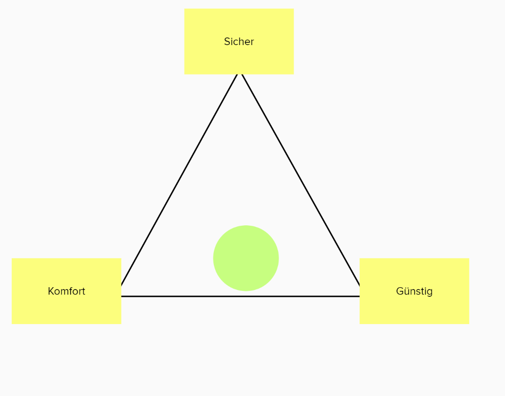
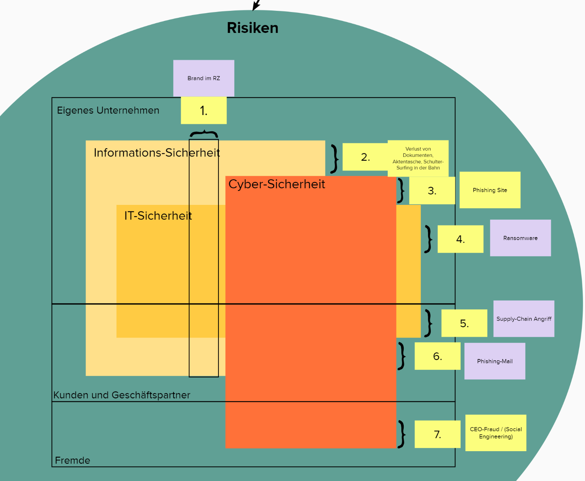
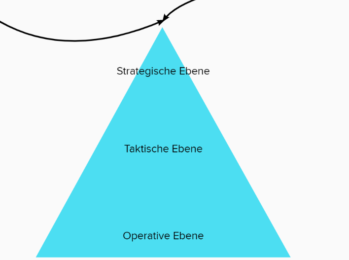

# IT-Sicherheitsmanagement <!-- omit in toc -->
Dieses File beinhaltete eine kleine Zusammenfassung der Vorlesung [IT-Sicherheitsmanagement](https://app.mural.co/t/muralworkspace0660/m/muralworkspace0660/1649403349728/628afc077b71280e3990441f323e0eb96e9fb9a7?sender=u97fae70e91dca3860c9e8161).
# Inhaltsverzeichnis <!-- omit in toc -->
- [Der Fall Buchbinder](#der-fall-buchbinder)
  - [Mögliche Ursachen](#mögliche-ursachen)
  - [Gegenmaßnahmen](#gegenmaßnahmen)
- [Exkurs: ISMS-Vergleich](#exkurs-isms-vergleich)
  - [ISO 27002:2013](#iso-270022013)
  - [TISAX](#tisax)
  - [PCI DSS](#pci-dss)
  - [BSI](#bsi)
- [Exkurs: S-Protect](#exkurs-s-protect)
- [ISMS](#isms)
  - [Information](#information)
  - [Sicherheit](#sicherheit)
  - [Management System](#management-system)

# [Der Fall Buchbinder](https://app.mural.co/t/muralworkspace0660/m/muralworkspace0660/1649403544278/ca053bed349485fd3eb457c9abc74d249721bb3c?sender=u97fae70e91dca3860c9e8161)

## Mögliche Ursachen
- Kostenersparnis im Bereich IT
- Fehlendes Fachwissen
- evtl. historisch gewachsen (SMB)
- Verfügbarkeit > Sicherheit
- Weg über die IT-Abteilung zu aufwendig
- Schatten IT
- fehlende Governance

## Gegenmaßnahmen
|Richtlinien/Prozesse|Präventiv|Detektiv|
|---|---|---|
|Prozesse und Data Lifecycle klar definieren|Ursache: Nachlässigkeit bei Config, Update, Debug|Audits|
|Service Level Agreement mit dem Server-Betreiber|Regelmäßige, automatisierte Scans des eigenen Netzwerks|Zusammenarbeit mit dem Sicherheitsexperten|
|Klassifizierung (SBF)|Vuln Scans etablieren|Auf Warnungen frühzeitig reagieren|
|Aufbewahrung (wo / wie lange) (Löschkonzept)|DB mit  Passwort schützen|Themen: Incident Response, Security 101, Datenumgang, Webbased Training|
|Vorgaben für Benutzername / Passwort|SMB Port blockieren|Penetrationstests|
|Berechtigungs-konzept|Backup verschlüsseln|
| |Baseline-Konfiguration / Härtung|
| |VPN-verbindung zum Server aufbauen|
| |Generelle Schulung der Mitarbeiter|

# Exkurs: [ISMS-Vergleich](https://app.mural.co/t/muralworkspace0660/m/muralworkspace0660/1650627698169/6c1698b2f4ecc70b2a05bb37584d6326040b7ca0?sender=ub64e6270e8be28f188f38372)

## ISO 27002:2013

## TISAX

## PCI DSS

## BSI

# Exkurs: [S-Protect](https://app.mural.co/t/muralworkspace0660/m/muralworkspace0660/1651821857612/2f18d6ec811388f090a85ebc6bc3fd93d7f257c6?sender=u97fae70e91dca3860c9e8161)
|Pro|Contra|
|---|---|
|weniger Phsising anfällig|suggeriert absolute Sicherheit
|auf aktuellen OS verfügbar|zusätzliches Tool, welches geupdated werden muss
|keine Kosten|keine Auskunft über technische Details
| einfache Bedienung|keine Zertifikate|
| |integrierter Password Manager + keine Tan -> alle Informationen auf einem Gerät

-> Risiken überwiegen  
-> auf keinen Fall im Business-Umfeld

# [ISMS](https://app.mural.co/t/muralworkspace0660/m/muralworkspace0660/1651832952585/bb799f32fbde1461e87e042e33d55374d1e06ebe?sender=u97fae70e91dca3860c9e8161)

## Information
Defionition:
>Information ist in der Informationstheorie das Wissen, das ein Absender einem Empfänger über einen Informationskanal vermittelt. Die Information kann dabei die Form von Signalen oder Code annehmen. Der Informationskanal ist in vielen Fällen ein Medium. Beim Empfänger führt die Information zu einem Zuwachs an Wissen.

**4-Sektoren Modell**
- Information als 4. Sektor (neben Produktion Landwirtschaft, dienstleistungen)
- Informationen gewinnen an Bedeutungen
- es gibt bereits Unternehmen der Geschäftskonzepte allein auf dem Austausch von Informationen basieren (Meta, Payback etc.) 

## Sicherheit
**Statistische Sicherheit**
>Ein System wird dann als sicher bezeichnet, wenn für den Angreifer der **Aufwand** für das Eindringen in das System **höher** ist als der daraus **resultierende Nutzen**. Deshalb ist es wichtig, die Hürden für einen erfolgreichen Einbruch möglichst hoch zu setzen und damit das Risiko zu reduzieren.

**Absolute Sicherheit**
>Ein System ist dann absolut sicher, wenn es **jedem denkbaren Angriff widerstehen** kann. Die absolute Sicherheit kann nur unter besonderen Bedingungen erreicht werden, die die Arbeitsfähigkeit des Systems oft erheblich einschränken (isolierte Systeme, wenige und hochqualifizierte Zugriffsberechtigte).

**Unterteilung verschiedner Bereiche der Sicherheit:**

## Management System

- Vorgehen nach Demingkreis (PDCA) und SDCA-Zyklus siehe [Deming Circle IT-Recht](IT-Recht.md#deming-circle-aka-pdca-cycle)

