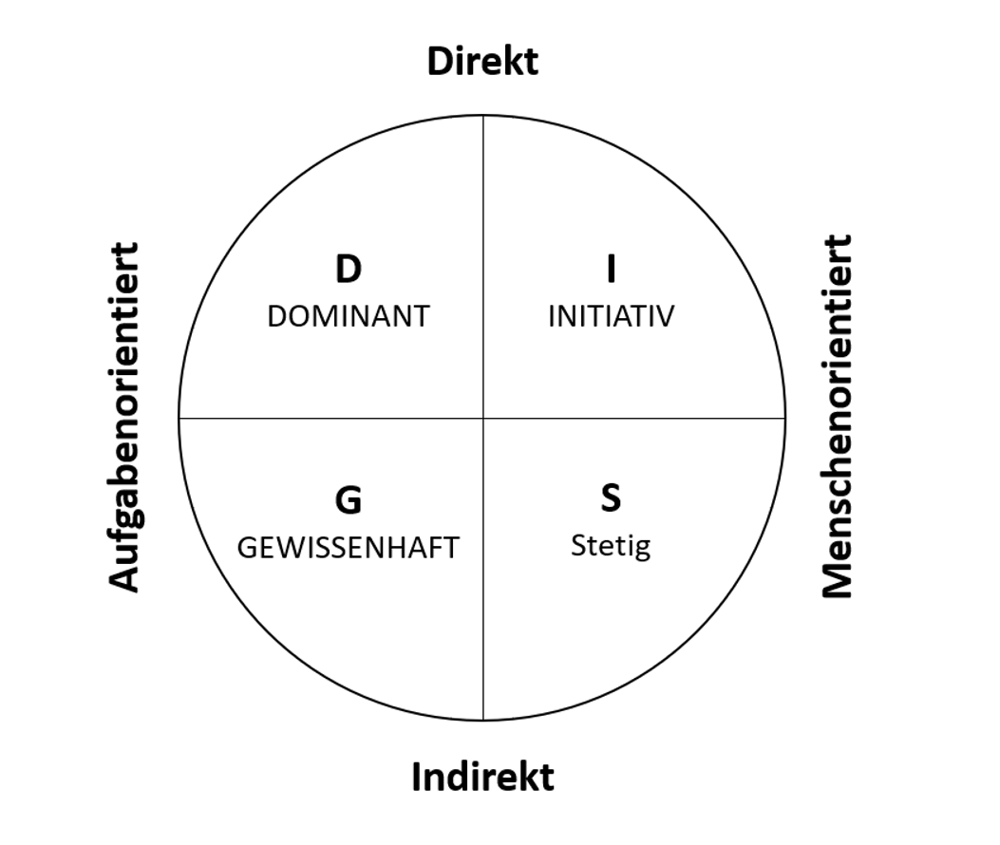
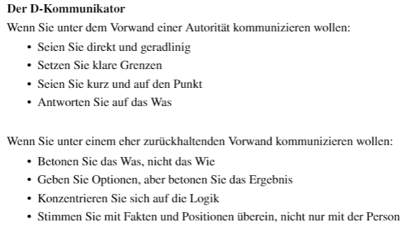
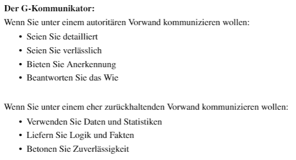
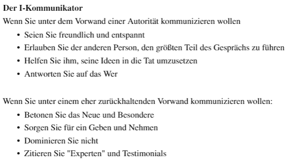
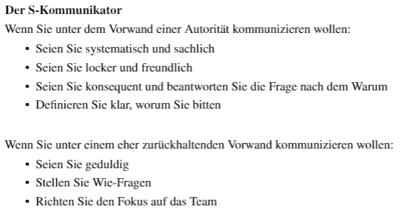

# Social Engineering <!-- omit in toc -->
Dieses File beinhaltete eine kleine Zusammenfassung der Vorlesung [Social Engineering](https://moodle.dhbw-mannheim.de/pluginfile.php/410370/course/section/57781/30042022.pdf).
# Inhaltsverzeichnis <!-- omit in toc -->
- [Kapitel 1 - Einführung](#kapitel-1---einführung)
  - [Definitionen](#definitionen)
    - [Social Engineering](#social-engineering)
  - [Ursachen für Sicherheitsvorfälle](#ursachen-für-sicherheitsvorfälle)
- [Kapitel 2.1 - Angriffsmechanismen](#kapitel-21---angriffsmechanismen)
  - [Vorurteile und Klischees](#vorurteile-und-klischees)
  - [Einordnung von Charakteren](#einordnung-von-charakteren)
    - [Menschentypen](#menschentypen)
    - [DISG Modell](#disg-modell)
    - [Anpassung des Kommunikationsstils](#anpassung-des-kommunikationsstils)
  - [Psychologie](#psychologie)
    - [Automatische Handlungsmuster](#automatische-handlungsmuster)
  - [Biologische Grundlagen](#biologische-grundlagen)
    - [Gehirn](#gehirn)
    - [Alpha- und Beta-Modus](#alpha--und-beta-modus)
    - [Bindungstheorie](#bindungstheorie)
    - [Oxytocin - The Molecule of Trust](#oxytocin---the-molecule-of-trust)
    - [Dopamin - The Molecule of More](#dopamin---the-molecule-of-more)
  - [Exkurs - Headhunting](#exkurs---headhunting)
  - [Grundlage der Kommunikation](#grundlage-der-kommunikation)
- [Kapitel 2.2 - Methoden des Social Engineerings](#kapitel-22---methoden-des-social-engineerings)
  - [Open Source Intelligence (OSINT)](#open-source-intelligence-osint)
    - [Aufgabe](#aufgabe)
  
# [Kapitel 1 - Einführung](https://app.mural.co/t/socialengineering4901/m/socialengineering4901/1649020782036/c4bb48a80903b77e09d006c14924b513ad560caa?sender=thomasklir4329)

## Definitionen
### Social Engineering
>Social Engineering ist jede Handlung, die eine Person beeinflusst,  eine Handlung zu unternehmen, die in ihrem oder seinem besten Interesse sein kann oder aber auch nicht. 

## Ursachen für Sicherheitsvorfälle
Durch die fortschreitende digitale Revolution entstehen wachsende Cyber Risiken. Die Zahl der Cyberangriffe hat sich im Vergleich zu 2017 mehr als verzehnfacht (stand 2019). *In **50% der Fälle** beginnt der Vorfall durch einen **menschlichen Fehler**.* 

# [Kapitel 2.1 - Angriffsmechanismen](https://app.mural.co/t/socialengineering4901/m/socialengineering4901/1649020782037/771454c0fc2c97c389d55333f2ba835509bc530b?sender=thomasklir4329)

## Vorurteile und Klischees

Bestehende Vorurteile und Klichees können genutzt werden, um Vertrauen zu gewinnen oder sich in eine Position oder Rolle zu begeben.  
Beispiele:
- `ältere Menschen`: wirken verletzlich und unschuldig
- `Brille`: suggeriert eine erhöhte Intelligenz
- `Kinder`: suggeriert Unschuldigkeit
- `Business-Kleidung`: wirkt professionell
- `Frauen`: wirken ungefährlicher
- `gleiche ethnische Gruppe`: höheres Vertrauen bei gleicher Gruppenzugehörigkeit 
- `Inder`: IT-nerds
- `Schwangere Frauen`: Wer neues Leben erschafft kann nichts böses vorhaben

## Einordnung von Charakteren
### Menschentypen
Modell mit [4 Menschentypen](https://www.youtube.com/watch?v=-IOp9qrjLJU):
1. Eulen
1. Haie
1. Wale
1. Delfine
### DISG Modell
DISG ist ein starkes Werkzeug, dass Ihnen hilft Menschen schnell zu lesen, und darauf
hin Ihren Kommunikationsstil anzupassen.

### Anpassung des Kommunikationsstils 
Je nach Gesprächspartner und gewünschter eigener Wirkung auf den Gegenüber sind unterschiedliche Komunikationstils erforderlich. Nach dem oben genannten DISG Modell gilt: 

## Psychologie
Es existieren gewisse psychologische Faktoren die Menschen dazu bringen eher Dinge zu tun ohne dies zu hinterfragen. Dazu zählen u.a.: 
- `Druck/Angst`: : Mögliche **Strafen** werden angedroht, falls eine Handlung ausbleibt oder
zu spät gehandelt wird - es wird **künstlicher Zeitdruck** erzeugt
- `Gier`: : Eine **Belohnung, Gewinn** oder sonstige Vorteile werden in Aussicht gestellt
- `Vertrauen`: Es werden vermeintliche **Gemeinsamkeiten** aufgezeigt, um Vertrauen zu erzeugen um dann nach einem Gefallen zu fragen
- `Hilfsbereitschaft`: Menschen möchten anderen Menschen gerne gefallen bzw. helfen. Es wird eine **Notsituation** erzeugt, in der das **Opfer helfen kann** - beispielsweise einmal kurz die Tür aufhalten
- `Autorität`: Der Angreifer nutzt die **Hierarchie** in einem Unternehmen aus. Niemand möchte gerne seinem vermeidlichen Vorgesetzten widersprechen - **Uniformen** haben hier eine besondere Wirkung
- `Lob`: Das Opfer wird bei seiner **Eitelkeit** gepackt, um Informationen zu erlangen beispielsweise in einem vermeidlichen Experteninterview
- `Interesse`: Vermeintlich **brisante Informationen** werden in Aussicht gestellt - spannende Inhalte werden angedeutet
- `Faulheit`
- `Scham`
- `Stolz`
- `Neid`
- `Anerkennung`

### Automatische Handlungsmuster
Um besser mit den unzähligen Entscheidungen umgehen zu können, die wir jeden Tag treffen müssen handeln wir nach sogenannten Faustregeln. 
**Reziprozität** 
>Reziprozität bedeutet **Gegenseitigkeit oder Wechselbezüglichkeit** und stellt ein Grundprinzip menschlichen Handelns dar (auch Prinzip der Gegenseitigkeit).
- wir fühlen uns dazu verpflichtet uns bei jmd der uns einen gefallen getan hat/uns etwas geschenkt hat zu revanchieren
- unabhängig von der symphatie für den Gegenüber

**Konsistenz** 
>Konsistenz bezeichnet in der Psychologie die **Widerspruchsfreiheit** des individuellen Verhaltens eines Menschen in sich und im Bezug auf das eigene Selbst, die zeitlich und über Situationen hinweg im Wesentlichen erhalten bleibt. 
- haben wir einmal eine **Entscheidung getroffen**, treten intra- und interpsyschische Vorgänge in Kraft, die uns dazu drängen, **konsistent** zu bleiben
- die Bindung oder Festlegung auf etwas bezeichnet man in der Sozialpsychologie auch als **Commitment**
- Ein Commitment ist nur wirksam, wenn es **aktiv**, **öffentlich**, mit **Anstrengungen** verbunden und **freiwillig** ist

**Soziale Bewährtheit** 
>Unter sozialer Bewährtheit versteht man, dass das Verhalten anderer als richtig angenommen und ggf. kopiert bzw. adaptiert wird
- Soziale Bewährtheit wirkt umso mehr, je **unsicherer** wir uns sind oder je **unklarer** oder **mehrdeutig** die Situation ist
- Soziale Bewährtheit kann zum sogenannten **kollektiven nicht-sehen-wollen Effekt** führen

**Sympathie** 
- **attraktive Menschen** werden besonders positive Eigenschaften zugeschrieben (Halo-Effekt)
- neben der Attraktivität hat auch **Ähnlichkeit** einen
Einfluss 
- Lob und Anerkennung in Form von **Komplimenten** lässt unser Gegenüber sympathischer erscheinen

**Autorität** 
- Faktoren: **Titel, Uniformen** und **Luxus**
-  Selbstwahrnehmung und Versuchsergebnisse klaffen weit auseinander

**Knappheit** 
- das Knappheitsprinzip besagt, dass Möglichkeiten
uns umso **wertvoller** erscheinen, je **weniger erreichbar** sie sind

## Biologische Grundlagen
### Gehirn
Das gehrin kann grob in 3 größere teilbereiche unterteilt werden:
1. Großhirnrinde
2. Limbisches System
3. Stammhirn

-> im Mittelpunkt beim SE steht in der Regel das **Limbische System**, da es **reflexartig und unmittelbar** reagiert und somit **aufrichtige Reaktionen** auslöst

### Alpha- und Beta-Modus
Man unterscheidet zwischen 2 Modi in dem sich das gehirn befinden kann: 
**Alpha-Modus**
- 8 bis 13 cps (Zyklen pro Sekunde)
- entspannt/Tagträumen

**Beta-Modus**
- 14 bis 100 cps
-  wach, aufmerksam

-> SE macht sich idR **Alpha Modus** zu nutze 
-> Je mehr **Emotionen** dabei ausgelöst werden, desto weniger
denken Sie rational 
-> es dauert etwa **30 Sekunden** bis Sie nach einer emotionalen Handlung wieder zum logischen Handeln zurückkommen

### Bindungstheorie
>Unter dem Begriff Bindung versteht man ein lang andauerndes, affektives Band zu bestimmten Personen, die nicht ohne weiteres auswechselbar sind und deren körperliche und
psychische Nähe und Unterstützung gesucht wird, wenn z. B. **Verunsicherung, Furcht, Trauer** erlebt wird und **Unterstützung benötigt** wird

- angeborenes, menschliches Bedürfnis zwischen einem Säugling und seiner primären Bezugsperson (sichert Überleben)
  
-> Wenn der Social Engineer also die **Bezugsperson überzeugen** kann, dass eine Handlung oder ein Vorhaben gerechtfertig ist, ist es leichter, die eigentliche Person davon zu überzeugen.

### Oxytocin - The Molecule of Trust
- **Kuschelhormon**
- Oxytocin **verbindet** uns mit anderen Menschen
- wird bei **sozialen Bindungen** und **Berührungen** ausgeschüttet

### Dopamin - The Molecule of More
- **Botenstoff des Glücks und der Belohnung**
- **Viel Dopamin** macht sich bemerkbar in **Extrovertiertheit** und die dominante Nutzung ist in der **rechten Gehirnhemisphäre**, was wiederum assoziiert wird mit **Kreativität**, **emotionaler Intelligenz**, **Abenteuerlust** und **Risikofreude**
- **Wenig Dopamin** kann eher zu **introvertiertem Verhalten** führen und die dominante **Gehirnhemisphäre ist die linke**. Was wiederum zu **Logik- und Faktenorientiertheit** führt. Die
**Sprache ist oft monoton und langsamer** und diese Personen haben eher ein **schlechtes Gedächtnis**

## Exkurs - Headhunting

> Dienstleistung zur Besetzung von vakanten Führungs- und Spezialistenfunktionen

## Grundlage der Kommunikation
Über **50%** der zwischenmenschlichen Kommunikation findet **non-verbal** statt. 

# [Kapitel 2.2 - Methoden des Social Engineerings](https://app.mural.co/t/socialengineering4901/m/socialengineering4901/1649020782033/8070bdeed19072c57fa853dc0c70cd7919645a8d?sender=thomasklir4329)

## Open Source Intelligence (OSINT)
### Aufgabe 
Die Automobilzulieferer Syntic Motors hat bemerkt, dass Cyber Angriffe ein&nbsp;hohes Risiko darstellen und würde gerne seine Security Abteilung erweitern,&nbsp;um den Bereich &lt;THEMA&gt; abzudecken.&nbsp;

Sie als begeisterter Social Engineer und Headhunter werden beauftragt&nbsp;alle Informationen über das PwC Deutschland &lt;THEMA&gt;-Team herauszufinden um ein&nbsp;mögliches Abwerben vorzubereiten. &nbsp;

Beschaffen Sie sich alle Informationen.&nbsp;

Sie sollten mindestens die nachfolgenden Fragen beantworten können:&nbsp;

1. Wie viele Personen arbeiten bei PwC im Bereich &lt;THEMA&gt;?
2. Wie heißen die handelnden Personen und wie ist deren Durchwahl / E-Mail Adresse?
3. Wie ist das Team hierarchisch aufgebaut?

**Ergebnisse für OT-Security**  

Dr. Oliver Hanka  
Director bei PwC Deutschland  
Tel.: +49 160 510-5836  
